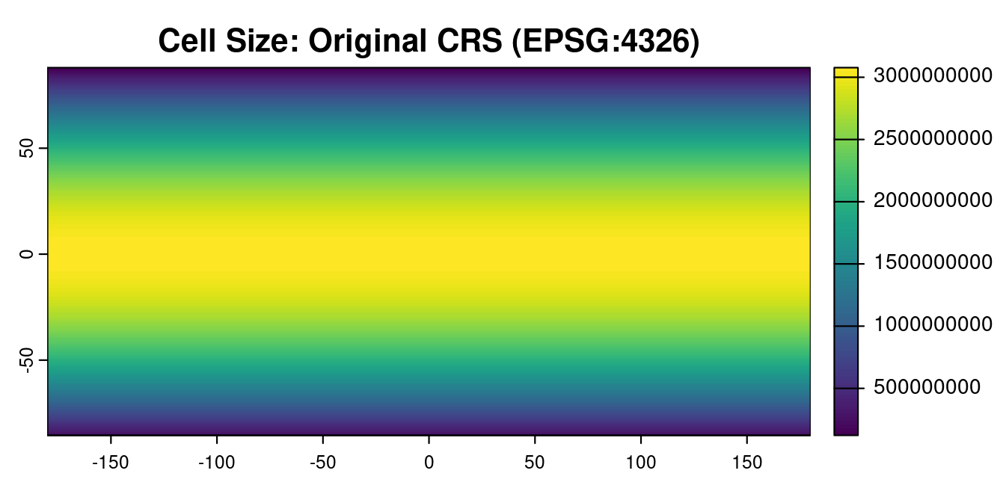

bulleted list

My Favorite Resources for Understanding Coordinate Reference Systems

 

My favorite resources for understanding this concept are:
<ul type = "circle">
  <li><a href="https://www.youtube.com/watch?v=kIID5FDi2JQ">this Vox video</a> on how areas of the globe must be distorted in order to render the 3-D ellipsoid of Earth into a 2D map</li>
  <li><a href="https://pro.arcgis.com/en/pro-app/latest/help/mapping/properties/coordinate-systems-and-projections.htm">this ArcGIS Pro article</a></li>
  <li>and <a href="https://ncxiao.github.io/map-projections/index.html">this interactive visualization</a> of how different projections warp the area of different parts of the world using <a href="https://en.wikipedia.org/wiki/Tissot%27s_indicatrix">Tissot's indicatrix</a> and Gedymin faces, by <a href="https://github.com/ncxiao">Ningchuan Xiao</a></li>
  <li>If you're not a fan of gifs you can click "pause" on that visualization, or use <a href="https://observablehq.com/@floledermann/projection-playground">this Map Projection Playground</a> by Florian Ledermann to visualize how different variables impact 2-D representations of area.</li>
</ul>

CSS

Text introducing plots

  <button class="tablinks" onclick="openTab(event, 'Figure1')" id="defaultOpen">Mollweide Projection Cell Size</button>
  <button class="tablinks" onclick="openTab(event, 'Figure2')">OG CRS Cell Size</button>

  

  

> 

    
My Favorite Resources for Understanding Coordinate Reference Systems

     
    
My favorite resources for understanding this concept are [this Vox video](https://www.youtube.com/watch?v=kIID5FDi2JQ) on how areas of the globe must be distorted in order to render the 3-D ellipsoid of Earth into a 2D map, [this ArcGIS Pro article](https://pro.arcgis.com/en/pro-app/latest/help/mapping/properties/coordinate-systems-and-projections.htm), and [Ningchuan Xiao’s interactive visualization](https://ncxiao.github.io/map-projections/index.html) of how different projections warp the area of different parts of the world using [Tissot’s indicatrix](https://en.wikipedia.org/wiki/Tissot%27s_indicatrix) and Gedymin faces. If you’re not a fan of gifs you can click “pause” on that visualization, or use [this Map Projection Playground](https://observablehq.com/@floledermann/projection-playground) by Florian Ledermann to visualize how different variables impact 2-D representations of area.

