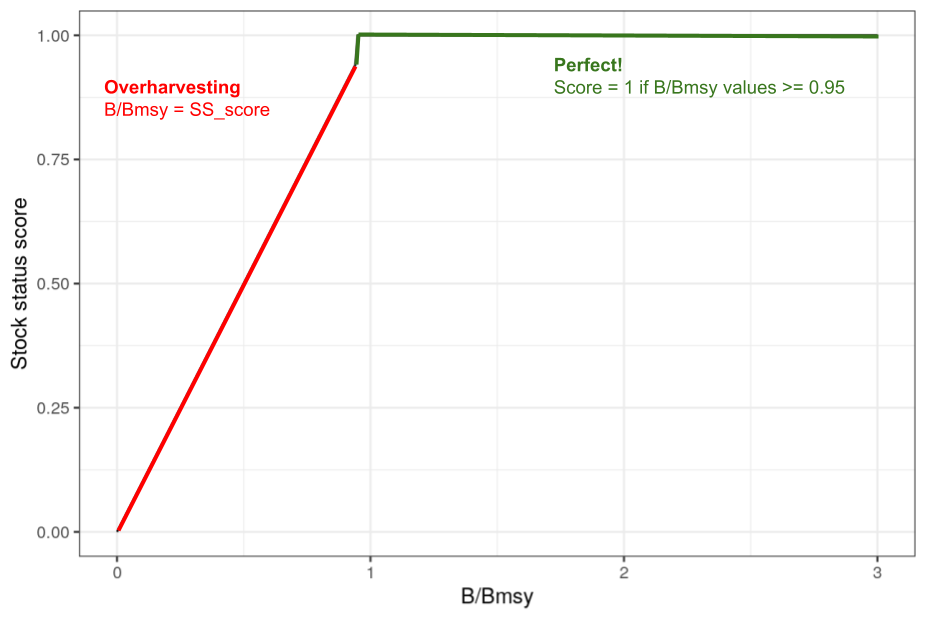
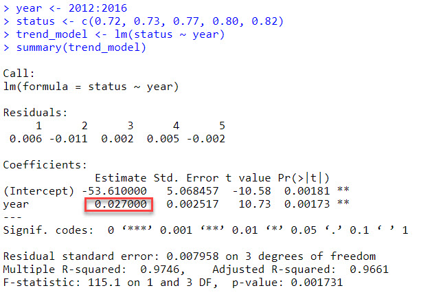

Work together to answer these questions.

All the information you need should be in the OHI Methods
[document](https://raw.githack.com/OHI-Science/ohi-global/published/documents/methods/Supplement.html#2_the_theory_of_ohi).

I will be around to answer any questions...so don't hesitate to get
clarification, extra guidance, or request hints!

### OHI score models and data

1.  What is the difference between a goal's "status" and "score"?

<br> Status has two components there is the *current status* which is
comparing a recent measure to a reference point and *likely future
status* which is the current status modified by variables like
resilience, pressures, and trend which are expected to influence it. The
score is the average of the current status and the likely future status.
<br>

2.  If a region's food provision goal has the following values, what
    would its food provision score be?

Predicted future status: 80

Current status: 60

<br> 70 <br>

3.  Given the following data, what would this region's Index score be?

| Goal/subgoal                      | Abbreviation | Score |
|-----------------------------------|--------------|-------|
| Artisanal Fishing Opportunity     | AO           | 90    |
| Habitat                           | HAB          | 50    |
| Species Condition                 | SPP          | 30    |
| Carbon Storage                    | CS           | 20    |
| Clean Waters                      | CW           | 95    |
| Coastal Livelihoods and Economies | LE           | 60    |
| Coastal Protection                | CP           | 80    |
| Food Provision                    | FP           | 85    |
| Natural Products                  | NP           | 100   |
| Sense of Place                    | SP           | 10    |
| Tourism and Recreation            | TR           | 50    |

NOTE: The abbreviations for subgoals have 3 letters and goals have 2
letters.

```{r}
(50+10+100+85+80+60+95+20+30+50+90)/11
```

<br> 60.9 <br>

4.  Fill in the missing values.

NOTE: Pressure and resilience must be multiplied by 0.01. Trend and
status are not modified.

```{r}
(1+0.67*0.1+(1-0.67)*(0.5-1))
(1+0.67*0.1+(1-0.67)*(0.5-0.5))
(75+80)/2
(75+90)/2
```

| Dimension               | Scenario 1 | Scenario 2 |
|-------------------------|------------|------------|
| Score                   | 82.5       | 77.5       |
| Current status          | 75         | 75         |
| Predicted future status | 90         | 80         |
| Trend                   | 0.10       | 0.10       |
| Pressure                | 100        | 50         |
| Resilience              | 50         | 50         |

QUESTION: How did a pressure change from 100 to 50 affect the final
score? Was this a larger or smaller effect than you would have expected?

<br> it reduced the overall score and predicted future status by more
than i thought<br>

### Humans as part of the ecosystem

<br> 5. To calculate the Fishery subgoal, we:

a.  Obtain B/Bmsy scores for each stock that is harvested. B/Bmsy is
    defined as: the ratio of observed biomass to the biomass that would
    provide maximum sustainable yield. When B/BMSY = 1, then biomass
    equals BMSY. If B/BMSY falls below 1, we have fished to much and the
    biomass is too low to provide maximum sustainable yield. For
    example, if B/BMSY = 0.5, then biomass is only 50% of that needed
    for maximum sustainable yield. (from:
    <http://www.catchshareindicators.org/wp-content/uploads/2013/12/NE_Biomass_Feb-2014.pdf>)

b.  We then convert B/Bmsy into a stock status score that ranges from
    0-1, with 1 reflecting a perfect score. The relationship between
    B/Bmsy values and stock status scores looks like this:



c.  Finally we average the stock status scores within each region (for
    the global we use a geometric mean weighted by catch).

QUESTION: B/Bmsy scores greater than 1 indicate the stock is doing well,
but is underharvested! Given this, do you think we should penalize
underharvesting? Why? Do you have any ideas for how we could account for
underharvesting without unduly penalizing regions that are trying to let
stocks recover?

<br> I don't think it should be penalized because this could be to
stabilize the ecosystem. <br>

### Gapfilling

6.  Imagine you are calculating OHI scores for 10 regions. The data you
    can find for an economic variable that is used to calculate the
    status of one of the goals looks like this:

| rgn_id | data |
|--------|------|
| 1      | 72   |
| 2      | 74   |
| 3      | 80   |
| 4      | 70   |
| 5      | NA   |
| 6      | NA   |
| 7      | 71   |
| 8      | 75   |
| 9      | 76   |
| 10     | 76   |

QUESTION: Should the missing values (NA is a missing value in R) remain
missing? If so, why?

Or, should you try to estimate the missing values? If so, how might you
go about estimating them? <br> No, all missing data should be filled in
if possible for index scores to be comparable-unless it isn't relevant
to a region. It could be estimated by looking at the factors that went
into determining the economic variable, looking if there is info from a
previous year, or seeing if other goals variables are related and can be
used to estimate this one. <br>

### Goal status and trend

<br>

7.  Read the methods section for the Lasting Special Places subgoal:
    hhttps://oceanhealthindex.org/images/htmls/Supplement.html#692_Lasting_special_places\_(subgoal_of_sense_of_place))

The information in this section describes how status and trend are
calculated for this goal, it also includes the data used to calculate
the pressure and resilience dimensions.

QUESTION: What is the reference point for this subgoal?

30% of area protected

Explore the links to the pressures and resilience data layers.

Follow this link to the functions.R file in ohi-global:
<https://github.com/OHI-Science/ohi-global/blob/draft/eez/conf/functions.R>

Find the Lasting Special Places function. See if you can reconcile the
model described in the Methods with the code. (NOTE: Just aim for a
large picture overview...at this point you do not need to understand
every step….or even most of this)

<br> the model in the methods is there in the status_data section of the
function for LSP but that is just a small component of the function.
There is a lot more that happens with sorting and combining datasets
<br>

8.  The trend for the Tourism and Recreation goal for the United States
    is -0.15. Describe what this means.

<br> In 5 years the LSP trend will decrease by 15% and the future status
is15% less than the current status<br>

9.  We are going to walk through a trend calculation. Using R, foollow
    along with the calculations.

Status data for a region's Tourism and Recreation goal:

| Year | Status |
|------|--------|
| 2010 | 72     |
| 2011 | 71     |
| 2012 | 72     |
| 2013 | 73     |
| 2014 | 77     |
| 2015 | 80     |
| 2016 | 82     |

*STEP 1* Estimate the average change per year using a linear regression
model



The 0.027 value is the slope estimate, which is the average change in
status per year estimated by the linear model.

*STEP 2* Obtain proportional change by dividing the slope estimate by
the earliest status value used in the linear model:

`0.027/0.72 = 0.0375`

There has been nearly a 4% increase in status per year.

*STEP 3* The goal is to predict the change in 5 years, so we multiply
the yearly proportional change by 5:

`0.0375 * 5 = 0.1875`

Status is predicted to increase about 19% in 5 years.

In 2021, status is predicted to be (ignoring pressure/resilience
dimensions): 82 \* (1 + 0.1875) = 97

QUESTION: What assumptions are we making by using this formulation of
trend to calculate the likely future status? No pressure or resilience
factored in, and the trend stays constant over 5 years.

QUESTION: Can you think of any scenarios when we would not use 5 years
of data to estimate trend? For any goals where data changes
significantly and not linearly by each year, if an event happens that
causes an anomaly, or if we have missing values we might have to use
more than 5 years.

<br> <br>

### Goal pressure and resilience

<br>

10. The pressure dimension plays a relatively small role in goal scores
    (see figure 4.1), but it takes a lot of effort to prepare these
    data!

The final pressure dimension is calculated for each region and goal
using a function from the ohicore package. The function requires several
pieces of information:

a.  A data layer for each pressure layer describing the magnitude of the
    pressure on a scale of 0-1. For example, here is the sea surface
    temperature pressure layer (low pressures are good and high
    pressures are bad):
    <https://github.com/OHI-Science/ohiprep_v2023/blob/gh-pages/globalprep/prs_sst/v2022/output/sst_updated.csv>

b.  Classifying the pressure category for each data layer. The pressure
    dimension is based on two types of pressures: Ecological and Social
    (Figure 4.2). The ecological pressures are broken into 5 categories
    (pollution, alien species, habitat destruction, fishing, and climate
    change). Each pressure data layer is assigned to a category in this
    file:
    <https://github.com/OHI-Science/ohi-global/blob/draft/eez/conf/pressure_categories.csv>

QUESTION: How many climate change pressures are there? 4

c.  Pressure x goal weighting. Pressures have little or no effect on
    some goals, but huge effects on others. The relationship between the
    goals and the pressure variables is described here:
    <https://github.com/OHI-Science/ohi-global/blob/draft/eez/conf/pressures_matrix.csv>

QUESTION: Which pressure layers affect the FIS subgoal? How many
regulatory pressure layers are there? How many social layers are there?
Which is more important: Ecological or Social pressures?

po_chemicals, po_nutrients, sp_alien, sp_genetic, hd_subtidal_sb,
hd_subtidal_hb, hd_intertidal, fp_com_hb, fp_com_lb, fp_art_lb,
fp_art_hb, ss_wgi, ss_spi

23 pressure layers, 2 social layers

Both are important since they both affect factors but there are a lot
more ecological pressures

QUESTION: Some goals, like Coastal Protection, have multiple “elements”.
Why?

For Coastal Protection there are multiple types of ecosystems like
mangroves and seagrass that are affected in different ways and
contribute to protection in different degrees

NOTE: It is convention to add a superscript to the pressure name that
describes its category: \* po=pollution \* hd=habitat destruction \*
sp=alien species \* fp=fishing pressure \* cc=climate change

<br> <br>

11. Similar to the pressures dimension, resilience plays a relatively
    small role in goal scores (see figure 4.1) but still takes a lot of
    effort.

The final pressure dimension is calculated for each region and goal
using a function from the ohicore package. The function requires several
pieces of information:

a.  A data layer for each pressure layer describing the magnitude of the
    pressure on a scale of 0-1. For example, here is the Social Progress
    Index layer (low resilience is bad and high resilience is good):
    <https://github.com/OHI-Science/ohiprep_v2023/blob/gh-pages/globalprep/prs_res_spi/v2022/output/spi_res.csv>

b.  The resilience dimension includes two major categories: Ecological
    and Social (Figure 4.3). Ecological resilience has two
    subcategories: Ecosystem and Regulatory. Regulatory is comprised of
    the same 5 subcomponents as the Ecological *pressures*: pollution,
    alien species, habitat destruction, fishing, and climate change.
    There is also a “goal” specific subcomponent. Each resilience data
    layer is assigned to a category in this file:
    <https://github.com/OHI-Science/ohi-global/blob/draft/eez/conf/resilience_categories.csv>

c.  The relationship between goals and resilience is described here:
    <https://github.com/OHI-Science/ohi-global/blob/draft/eez/conf/resilience_matrix.csv>
    <br> <br>

### Data layers

<br>

12. Explore table 7.0.1 in the methods.

<br> <br>
