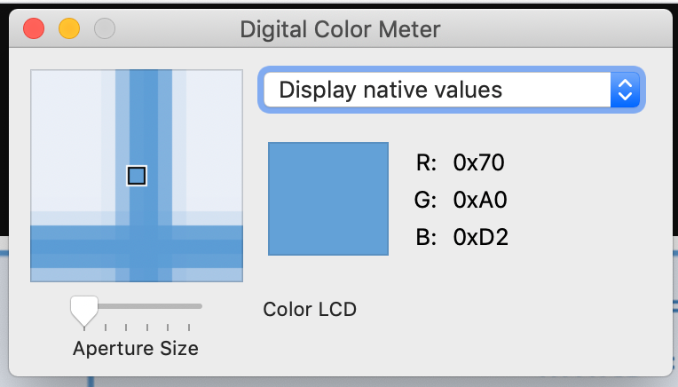
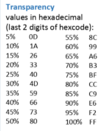
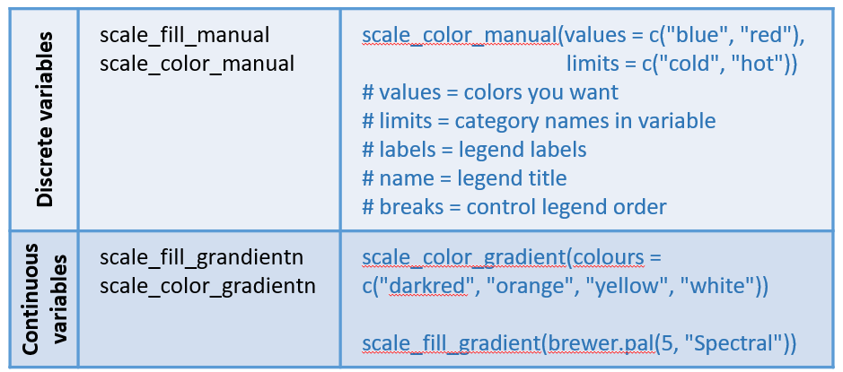

One of the more challenging aspects of creating a good plot is selecting colors.  We are here to help!

## Packages

Install and load the RColorBrewer, colorspace, and scales packages.  Both RColorBrewer and colorspace have nice palettes and colorspace and scales have additional functions for dealing with color. 

```{r color_packs, eval=TRUE, echo=TRUE, warning=FALSE, message=FALSE}

install.packages("RColorBrewer")
install.packages("colorspace")
install.packages("scales")

library("RColorBrewer")
library("colorspace")
library(scales)

```
<br>

## Key resources and functions

I often refer to this resource: https://github.com/EmilHvitfeldt/r-color-palettes

It describes lots of R color palettes and has links to other great websites.


These are the functions I find myself using over and over again.
<br>

function  |  description   | example
---------- | -------------- | -----------------
scales::show_col  | creates a plot with the colors  | show_col(c("#000000", "#4E1005", "#A1200D", "#E13217"))
colorRampPalette | interpolates between colors to form a continuous color ramp  | colorRampPalette(c("#A1200D", "#E13217"), space="Lab")(21)
colorspace::lighten  | automatically lighten all your colors (this can help make a plot look less intense)  | lighten(c("#A1200D", "#E13217"), amount = 0.3)

<br>

## Color palettes: use them!

Unless you are doing something very simple (e.g. 1-3 colors), you will have better luck using a color palette than trying to select your own colors (which usually results in hideous color combinations).  There are many color palette packages, but one of the best known is [RColorBrewer](http://colorbrewer2.org/#type=sequential&scheme=BuGn&n=3).

To see the available palettes in RColorBrewer:
```{r colorbrewer2, eval=TRUE, echo=TRUE, warning=FALSE, message=FALSE}

display.brewer.all()

```
<br>

To select a palette:

```{r palette, eval=TRUE, echo=TRUE, warning=FALSE, message=FALSE}

my_palette <- brewer.pal(n=9, "YlOrRd")

```
<br>

## Hexidecimal

R uses hexidecimal to represent colors. Hexadecimal is a base-16 number system used to describe color.  Red, green, and blue are each represented by two characters (#rrggbb).  Each character has 16 possible symbols:  0,1,2,3,4,5,6,7,8,9,A,B,C,D,E,F 

“00” can be interpreted as 0.0 and “FF” as 1.0, i.e., red= #FF0000 , black=#000000, white = #FFFFFF

A color palette is actually just a simple vector of hexidecimal values:

```{r hexidecimal, eval=TRUE, echo=TRUE, warning=FALSE, message=FALSE}

my_palette

```

Use hexidecimal format for colors in R because it is the most direct approach.
<br>

## Controlling color scales

An off the shelf color palette will rarely meet your exact needs.  Sometimes you will want to eliminate a color or adjust darkness. You might want one side of the scale to be more dominant.  Controlling the color scale is best accomplished by manipulating the vector of hexidecimal values that represents your color scale.  

The first step is getting the hexidecimal values for your color scale.  The exact mechanism will depend on the package you are using for your color palette.  

When all else fails I will get the values by hand using an app that allows you to get the hexidecimal values of colors on your screen. And if your aren't going to be a regular user of a particular color palette package, this is a much easier option.

On Macs you can use the "Digital Color Meter" (NOTE: you have to change the settings to report in hexidecimal). 
<br>

<br>
On PCs, I have used Pixie (http://www.nattyware.com/pixie.php). 

### Controlling color scales: an example

We will manipulate our color vector to acheive the colors we want on a raster.

*STEP 1*
Find a color scale you like.  We will use a palette from the beyonce package (https://github.com/dill/beyonce).
```{r, eval=TRUE, echo=TRUE, warning=FALSE, message=FALSE}

#install if you don't have:
devtools::install_github("dill/beyonce")

library(beyonce)

```
<br>

*STEP 2* 
Pick a palette and quickly explore.
```{r, eval=TRUE, echo=TRUE, warning=FALSE, message=FALSE}
# we will plot a volcano raster using the default color palette
image(volcano, asp=1)

# this color palette seems good
my_colors <- beyonce_palette(123)
my_colors
# convert to vector:
my_colors_vector <- c(my_colors)
my_colors_vector

image(volcano, asp=1, col=my_colors_vector)

```
<br>

*STEP 3* 
Making a discrete color palette into a continuous color ramp.
  
In the above example, the plot does not look great because the palette consists of only 6 colors and we want a continuous color gradient. There are very nice functions in the beyonce palette to acheive this, but these functions are specific to the package so I tend to not use this approach.  
  
Instead, I use a more general function:
  
`colorRampPalette`

<br>

```{r, eval=TRUE, echo=TRUE, warning=FALSE, message=FALSE}

# continuous palette, beyonce package method: 
example_continuous_pal <- beyonce_palette(123, 21, type = "continuous")
example_continuous_pal

# a general method that works everywhere
continuous_pal <- colorRampPalette(my_colors_vector, space="Lab")(21)
continuous_pal

# test it:
image(volcano, asp=1, col=continuous_pal)

```
<br>

*STEP 4* 
Adjusting the palette

I adjust the scaling of the color palette by manipulating the color vector.

For example, if we wanted to make the dark region of the volcano plot less dark, we could delete some of the dark values.

```{r, eval=TRUE, echo=TRUE, warning=FALSE, message=FALSE}

continuous_pal <- colorRampPalette(my_colors_vector, space="Lab")(21)

# eliminating the first 4 dark colors in our vector
continuous_pal_less_dark <- continuous_pal[5:length(continuous_pal)]

# test it:
image(volcano, asp=1, col=continuous_pal_less_dark)

```

<br>

Or, if you want to replace the portion of the color ramp with something else you can revisit the original palette and replace the gray hexidecimal values with another color.

```{r, eval=TRUE, echo=TRUE, warning=FALSE, message=FALSE}

my_colors <- beyonce_palette(123)
my_colors

c(my_colors)

my_new_colors <- c("#000000", "#4E1005", "#A1200D", "#E13217", "#EEE8AA", "#BDB76B")

## take a look
show_col(my_new_colors)
###OOOHHH...that is going to be beautiful :)

## make a continuous color ramp
my_new_colors_ramp <- colorRampPalette(my_new_colors, space="Lab")(21)
image(volcano, asp=1, col=my_new_colors_ramp)

```
<br>

## Transparency
Two additional characters can be added to the end of the hexidecimal value to describe transparency (#rrggbbaa: red, green, blue, alpha)


<br>

## ggplot2

There are lots of functions in ggplots for controlling color.  However, lots of choice often leads to confusion, and I only use 2.

The function you will want to use to specify color in ggplot2 depends on whether the color is mapped to a  discrete/categorical data variable, or a continuous variable.  There are a LOT of options in ggplot2, but these are the approaches I have settled on because they are the most flexible:



<br>
Load the library to the workspace and read in some data:
```{r, echo=TRUE, eval=TRUE, warning=FALSE, message=FALSE}

library(ggplot2)

ohi_data <- read.csv("https://raw.githubusercontent.com/OHI-Science/data-science-training/master/data/OHI_global_data.csv")

```
<br>

In the following case we map color to a continuous variable, so we will use the scale_color_gradientn function with the palette we selected above:

```{r palette_cont, eval=TRUE, echo=TRUE, warning=FALSE, message=FALSE}

ggplot(data = ohi_data, aes(x = OHI_score, y = OHI_trend, color = HDI)) + 
  geom_point(size =3) +
  scale_colour_gradientn(colors = my_palette)
  
```

<br>

This function takes a vector of colors and interpolates between the colors to get a gradient.


If we are mapping color to a discrete variable, we will use the scale_color_manual function:
```{r palette_discrete, eval=TRUE, echo=TRUE, warning=FALSE, message=FALSE}

# lets use a discrete color scale
my_palette <- brewer.pal(n=12, "Set3")
ggplot(data = ohi_data, aes(x = OHI_score, y = HDI, color = georegion_one)) + 
  geom_point(size = 3) +
  scale_color_manual(values = my_palette)

# Note the first 7 of the 12 colors are used in the plot

```

The scale_color_manual function also has a lot of great arguments that allow you to control which colors are associated with each factor level, the names used in the legend, and other controls. 

**Hint** 
If the "color" functions aren't working, try the "fill" version of the function.
